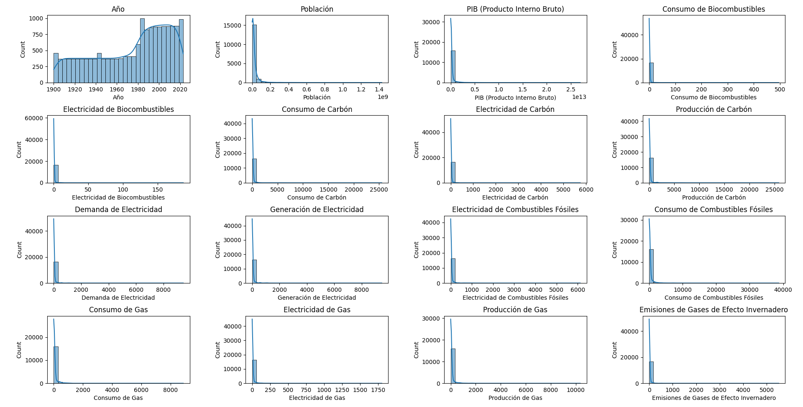
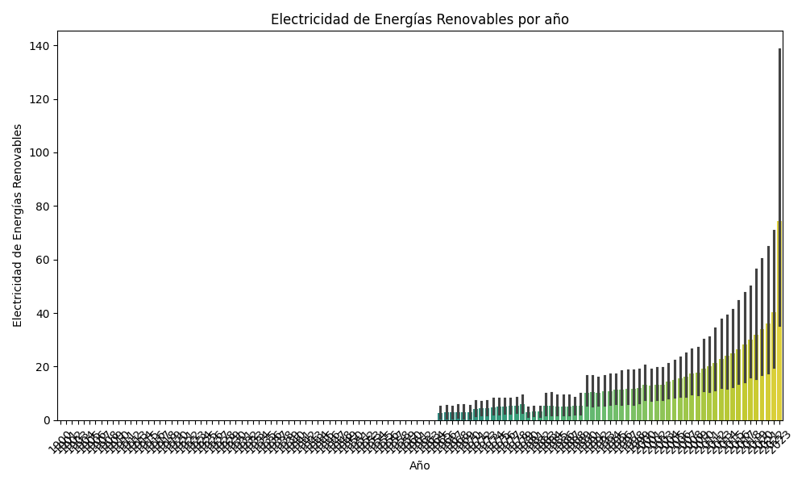

# Análisis del consumo mundial de energía

**Descripción del proyecto:**

Este proyecto tiene como objetivo analizar el consumo energético mundial y su impacto en el medio ambiente, utilizando el conjunto de datos "World Energy Consumption" de Our World in Data. Se explorarán las tendencias del consumo de energía, la combinación energética y las emisiones de CO2 a nivel global y por país. El proyecto culminará con la creación de un dashboard interactivo en Power BI que permitirá a los usuarios visualizar y analizar los datos de forma dinámica.

**Caso de estudio:** Data Analytics End to End Project

**Herramientas:**

* Lenguajes de programación: SQL y Python
* Herramientas de visualización: Power BI 
* Control de versiones: Git y GitHub
* Gestión de proyectos: [Kanban en Trello: Consumo mundial de energía](https://trello.com/invite/b/671a1203b3bfa3ec8786b630/ATTIaffb7d66c0eddc98f4f3a4fda1524c1cA4661B61/consumo-mundial-de-energia)

**Datasets:**

* [Our World in Data: World Energy Consumption](https://github.com/owid/energy-data) - Este dataset en formato CSV contiene información sobre consumo de energía, mezcla de energía, mezcla de electricidad y otros indicadores relevantes, organizados por ubicación y año. 
* [Codebook](https://github.com/owid/energy-data/blob/master/owid-energy-codebook.csv) -  Este dataset proporciona un libro de Excel en formato XLSX de códigos completo con descripciones y fuentes para cada indicador en el conjunto de datos. 
* [Tabla de países en español](https://gist.github.com/Yizack/bbfce31e0217a3689c8d961a356cb10d/raw/7ffa5b94615c6681d68c54fe7edcca098fae180b/countries.json) - Este archivo JSON nos permitirá establecer las relaciones está por países en español.

**Idea de negocio:**

Este proyecto se centra en proporcionar información clave sobre el consumo energético mundial a diferentes stakeholders. El dashboard interactivo permitirá a los usuarios:

* **Investigadores:** Analizar las tendencias energéticas, la evolución de las fuentes de energía y su impacto en el medio ambiente.
* **Responsables políticos:**  Tomar decisiones informadas sobre políticas energéticas y  promover la transición hacia energías renovables.
* **Organizaciones internacionales:**  Monitorear el progreso hacia los objetivos de desarrollo sostenible relacionados con la energía.
* **Público en general:**  Conocer el impacto de su consumo energético y tomar decisiones más sostenibles.

**Hipótesis:**

1. **El consumo de energía primaria está correlacionado con el PIB de un país.** Se espera que los países con mayor PIB tengan un mayor consumo de energía primaria.
2. **Las emisiones de gases de efecto invernadero están relacionadas con el consumo de combustibles fósiles.**  Los países que consumen más combustibles fósiles tenderán a tener mayores emisiones de gases de efecto invernadero.
3. **La proporción de energía renovable en la combinación energética de un país está relacionada con su nivel de desarrollo económico.** Los países con mayor PIB per cápita podrían tener una mayor inversión en energías renovables.
4. **Existe una diferencia significativa en el consumo de energía per cápita entre las diferentes regiones del mundo.**  Se espera que regiones como Norteamérica tengan un consumo per cápita mayor que regiones como África Subsahariana.
5. **Ha habido un aumento en la generación de electricidad a partir de fuentes renovables en los últimos años.**  Se espera observar una tendencia creciente en la producción de energía solar, eólica e hidroeléctrica a lo largo del tiempo.

**Métricas:**

Para el análisis cuantitativo, se utilizarán las siguientes métricas:

1.  **Consumo de energía primaria per cápita:** Indica la cantidad de energía primaria consumida por persona en un país.
2.  **Emisiones de CO2 per cápita:** Mide las emisiones de dióxido de carbono por persona en un país.
3.  **Proporción de energía renovable en la combinación energética:** Representa el porcentaje de energía renovable en el consumo total de energía de un país.
4.  **Intensidad energética:** Mide la cantidad de energía consumida por unidad de PIB.
5.  **Eficiencia energética:** Indica la cantidad de PIB producida por unidad de energía consumida.
6.  **Consumo de energía por sector (industrial, residencial, comercial, transporte):** Permite analizar el consumo energético en diferentes sectores de la economía.
7.  **Crecimiento del consumo de energía:** Mide la tasa de crecimiento anual del consumo de energía.
8.  **Índice de desarrollo humano (IDH):** Un indicador compuesto que mide el desarrollo humano de un país, que puede ser comparado con el consumo de energía.
9.  **PIB per cápita:** Indica el valor del PIB dividido por la población de un país.
10. **Tasa de electrificación:** Representa el porcentaje de la población con acceso a la electricidad.
11. **Consumo de electricidad per cápita:** Mide la cantidad de electricidad consumida por persona.
12. **Producción de electricidad por fuente de energía:** Permite analizar la contribución de cada fuente de energía a la generación de electricidad.
13. **Costo de la electricidad:** Indica el precio promedio de la electricidad para los consumidores.
14. **Emisiones de CO2 por unidad de energía producida:** Mide la cantidad de CO2 emitida por unidad de energía generada.
15. **Inversión en energías renovables:** Representa la cantidad de dinero invertido en el desarrollo de energías renovables.
16. **Número de empleos en el sector de las energías renovables:** Indica la cantidad de personas empleadas en el sector de las energías renovables.
17. **Superficie de tierra dedicada a la producción de energía renovable:** Mide la cantidad de tierra utilizada para la generación de energía renovable.
18. **Potencial de energía renovable:** Estima la cantidad de energía renovable que se puede generar en un país.
19. **Dependencia de la importación de energía:** Mide la proporción de energía que un país importa del extranjero.
20. **Seguridad energética:** Evalúa la capacidad de un país para satisfacer sus necesidades energéticas de forma confiable y sostenible.

**Objetivos:**

* **Analizar:**
    *  Las tendencias del consumo energético a nivel global y por país a lo largo del tiempo.
    *  La evolución de la combinación energética (fuentes de energía utilizadas).
    *  La relación entre el consumo de energía, las emisiones de CO2 y el desarrollo económico.
* **Visualizar:**
    *  Creación de un dashboard interactivo con mapas, gráficos y tablas para visualizar los datos.
    *  Permitir a los usuarios explorar los datos por país, región, año y fuente de energía.
* **Comunicar:**
    *  Presentar los resultados del análisis de forma clara y concisa.
    *  Extraer conclusiones y recomendaciones basadas en los datos.

**Etapas del Proyecto:**

1. **Planificación:**
    * Definición del alcance del proyecto y las preguntas de investigación.
    * Crear un tablero Kanban en Trello para la gestión de tareas.
    * Descargar y explorar los datasets.
2. **Preparación de datos:**
    * Limpiar y transformar los datos (manejo de valores faltantes, conversión de tipos de datos).
    * Realizar análisis exploratorio de datos (estadísticas descriptivas, visualizaciones).
3. **Análisis de datos:**
    *  Utilizar SQL para realizar consultas y análisis de datos.
    *  Identificar patrones, tendencias y relaciones entre las variables.
4. **Visualización de datos:**
    *  Diseñar y construir un dashboard interactivo en Power BI.
    *  Seleccionar las visualizaciones más adecuadas para representar los datos.
5. **Presentación:**
    *  Crear una presentación en Canva para comunicar los resultados del análisis.
    *  Resaltar las conclusiones clave y las ideas principales.

## Análisis Exploratorio de Datos

Se realizaron histogramas para visualizar la distribución de las variables del dataset:

**Resultados esperados:**

* Un dashboard interactivo que permita visualizar y analizar el consumo energético mundial.
* Un informe con los resultados del análisis y las conclusiones.
* Una presentación que comunique los hallazgos del proyecto de forma efectiva.

**Resultados:**

El análisis de datos reveló las siguientes tendencias clave:

* **Correlación entre el consumo de energía y el PIB:** Se confirmó una fuerte correlación positiva entre el consumo de energía primaria y el PIB de los países. Los países con mayor PIB tienden a consumir más energía, lo que indica una relación directa entre el desarrollo económico y el consumo energético. (Insertar gráfico de dispersión: 'relacion_pib_consumo_energia.json')
* **Impacto del consumo de combustibles fósiles en las emisiones de CO2:** Se observó una relación significativa entre el consumo de combustibles fósiles y las emisiones de CO2. Los países con mayor consumo de combustibles fósiles presentan mayores emisiones de CO2, lo que destaca la importancia de la transición hacia fuentes de energía más limpias. (Insertar gráfico de barras)
* **Crecimiento de las energías renovables:** Se observó un aumento en la generación de electricidad a partir de fuentes renovables en los últimos años, especialmente en países con mayor PIB per cápita. Esto sugiere que la inversión en energías renovables está aumentando, aunque aún queda mucho por hacer para alcanzar una combinación energética sostenible. (Insertar gráfico de líneas)
* **Disparidades regionales en el consumo de energía:** Se encontraron diferencias significativas en el consumo de energía per cápita entre las diferentes regiones del mundo.  Norteamérica presenta el mayor consumo per cápita, mientras que África Subsahariana tiene el menor. Estas disparidades reflejan las desigualdades en el acceso a la energía y el desarrollo económico. (Insertar mapa coroplético)

**Presentación:**

* [Presentación en Canva](https://www.canva.com/design/DAGUeVIQCE8/MxvAJObkmjYpYdt7s3lL_g/edit?utm_content=DAGUeVIQCE8&utm_campaign=designshare&utm_medium=link2&utm_source=sharebutton)

**Dashboard:**

Puedes acceder al dashboard interactivo en Power BI a través del siguiente enlace:

* [Dashboard en Power BI](https://app.powerbi.com/links/kifHRQoNmc?ctid=2b079dc7-e2ea-45bc-9182-0fde14b549b1&pbi_source=linkShare)

**Autor:** 

Hugo Ortuño Suárez

* [LinkedIn](https://www.linkedin.com/in/hugo-ortu%C3%B1o-suarez/)
* [GitHub](https://github.com/hugoortuno)